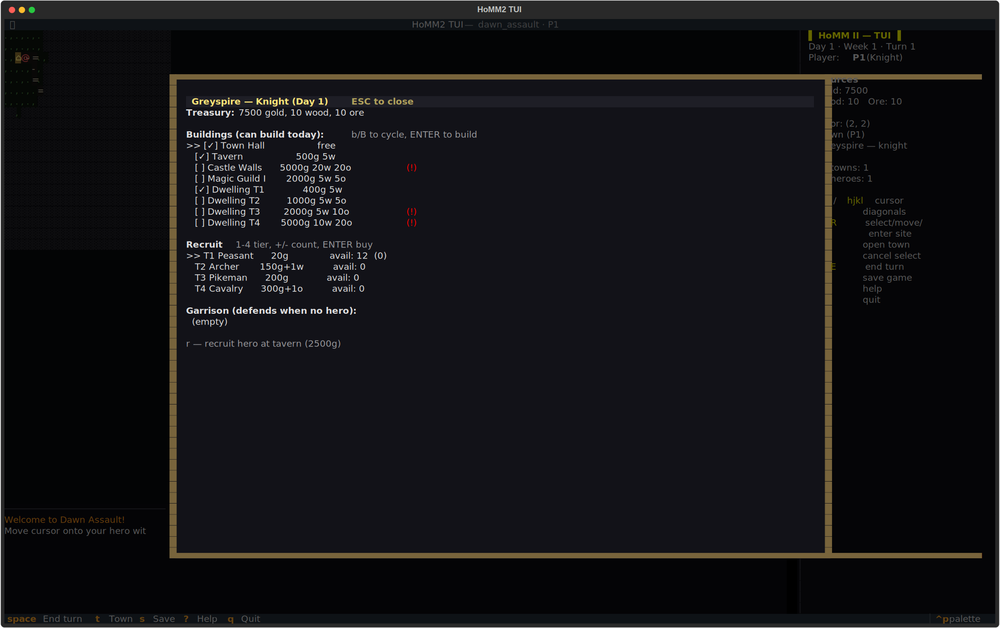
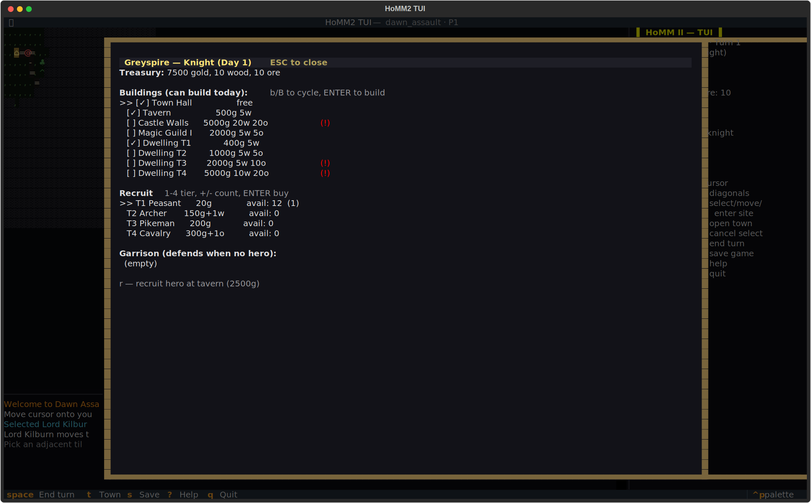

# heroes-siege-tui
The age of heroes begins.




## About
Six factions. Seven artifacts. One enchanted world. Recruit heroes, build castles, hoard resources, lead stack-of-troops armies across the hex field, duel rival champions for the realm. Clean-room Heroes of Might and Magic II in ASCII — with all the dragons, all the liches, and all the week-of-the-troll it can carry.

## Screenshots


## Install & Run
```bash
git clone https://github.com/akakabrian/heroes-siege-tui
cd heroes-siege-tui
make
make run
```

## Controls
<Add controls info from code or existing README>

## Testing
```bash
make test       # QA harness
make playtest   # scripted critical-path run
make perf       # performance baseline
```

## License
MIT

## Built with
- [Textual](https://textual.textualize.io/) — the TUI framework
- [tui-game-build](https://github.com/akakabrian/tui-foundry) — shared build process
